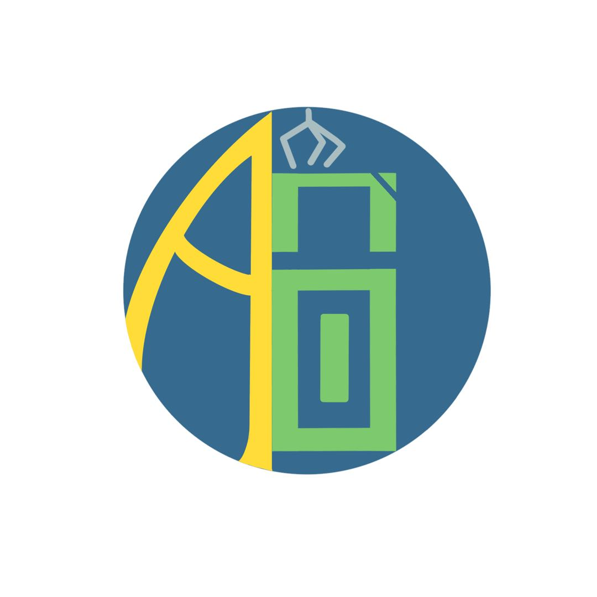

<h1 align="center">Welcome to Auto Bin 👋</h1>
<p align="center">
  <a href="https://www.npmjs.com/package/readme-md-generator" target="_blank"> 
  </a>
    
  <a href="https://github.com/JnkDog/autobin/blob/main/README.md" target="_blank">
  </a>
    
  <a href="https://github.com/JnkDog/autobin/graphs/code-frequency" target="_blank">
  </a>
  <a href="https://github.com/kefranabg/readme-md-generator/blob/master/LICENSE" target="_blank">
      
  </a>
</p>


> A C++ project to identify categories of trash and automatically open the corresponding trash cans. 

### 🏠 [Homepage](https://github.com/JnkDog/autobin#readme)

## Media

<!-- {:height="20%" width="20%"} -->
<p align="center">

</p>

<p align="center">
  <a href="">
    
  </a>
  <a href="">
    
  </a>
  <a href="">
    
  </a>
  <a href="">
    
  </a>
</p>

## Model


## Material list

1.Rraspberrypi 4B  1  
2.Adafruit PCA9685 16-Channel Servo Driver  1  
3.MG996R Servo Motor  4  
4.Trash can  4  
5.Breadboard Jumper Wires  

## Connection

1.GND -> RPi GND    
2.SCL -> RPi SCL0  
3.SDA -> RPi SDA0   
4.VCC -> RPi 3.3V  


## Prerequisites

- fswebcam
- git
- jsoncpp
- node
- cmake
- wiringPi

## Install

```sh
git clone https://github.com/JnkDog/autobin
cd autobin
git submodule update --init
```
You can get more detailed steps in our [wiki](https://github.com/JnkDog/autobin/wiki/ENG-02-Install-And-Launch)

## Usage
Our project framework contains many sub-projects, so we wrote a shell script to execute it, the detailed process can be found in the [wiki](https://github.com/JnkDog/autobin/wiki/ENG-02-Install-And-Launch).

```sh
# Ensure that the dependency libraries are installed
# Start the shell script to make
cd autobin
sh make.sh
# Start the shell script to boost
# ATTENTION: 1. You need to find the recognization server.
#            2. We use BAIDU API, more information to our wiki(https://github.com/JnkDog/autobin/wiki/ENG-05-Camera)
sh boost.sh
```

## Author

👦 **Kuihong Chen**  [JnkDog](https://github.com/JnkDog)
  * Web APP & Web Server & Image Recognition & Shell

👧 **Yuyang Zhou**
  * Hardware & IIC communication & PCA9685 & Servo Motor Control
  
👦 **Pengchong Wang**

## 🤝 Contributing

Contributions, issues and feature requests are welcome!<br />Feel free to check [issues page](https://github.com/JnkDog/autobin/issues).

## Show your support

Give a ⭐️ if this project helped you!

## 📝 License

Copyright © 2021 [JnkDog](https://github.com/JnkDog).<br />
This project is [MIT](https://github.com/JnkDog/autobin/blob/main/LICENSE) licensed.

***
